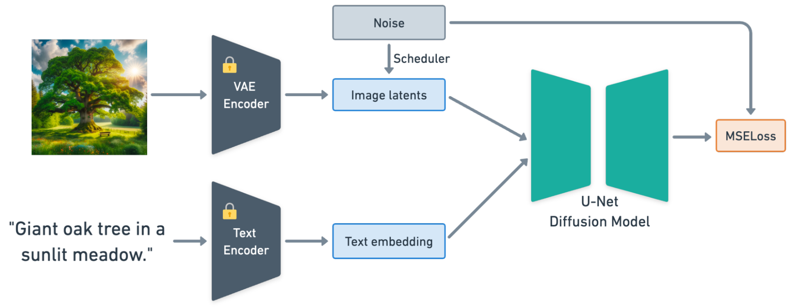
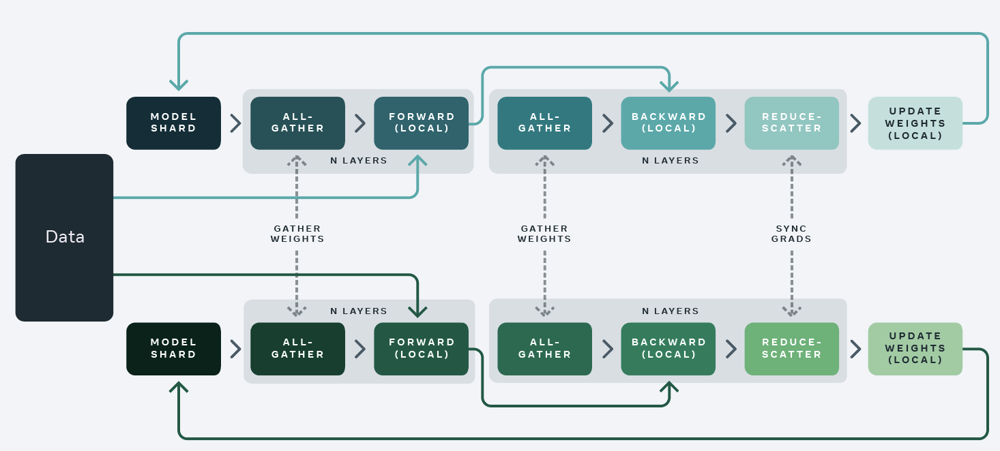
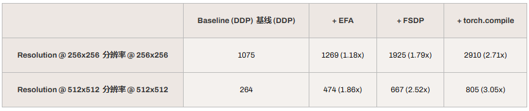
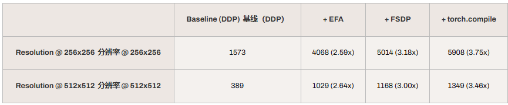
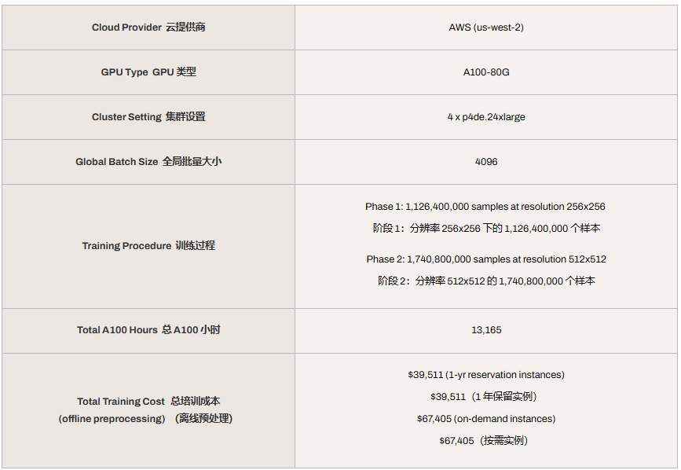

# 通过 Anyscale 将 Stable Diffusion 的预训练成本降低 3.7 倍

> 在这篇博客中，我们介绍了一个针对 Stable Diffusion v2 模型的高级预训练解决方案，利用 Ray 与 Anyscale Platform 的强大能力来提升可扩展性和成本效率。

**IN Summary：**

- 我们在约 20 亿张图像的海量数据集上对 Stable Diffusion v2 模型进行了预训练，成本**不到 4 万美元**；
- 我们通过 Ray Data 消除了预处理瓶颈，将**训练吞吐量提升了 30%**；
- 我们进一步应用系统和算法优化，将训练成本相比基线方法**降低 3 倍**。

# Stable Diffusion Primer

Stable Diffusion 是一个条件生成模型，可以根据文本提示生成高质量图像。

图 1 展示了其训练流程：

- 一个预训练的 VAE 和文本编码器（OpenCLIP-ViT/H）对输入的图像和文本提示进行编码；
- 一个可训练的 U-Net 模型结合图像潜在表示和文本嵌入来学习扩散过程；
- 损失基于输入噪声和 U-Net 预测的噪声进行计算；
- 该模型在 256x256 图像上进行预训练（阶段 1），随后在 512x512 图像上进行预训练（阶段 2）。

尽管基线预训练的 Stable Diffusion 生成质量令人印象深刻，但涉及到可能存在偏见、非法或受版权保护的内容，亦或是独特的需求，许多公司选择通过自己精心策划的数据集来预训练自己的模型。

# 在 Stable Diffusion 预训练中的挑战

基线预训练需要在数十亿张图像上消耗超过 200,000 个 A100 GPU 小时。这凸显了由于规模庞大和计算密集性而带来的预训练固有挑战。

其中存在 3 个主要因素会严重阻碍训练效率：

- **数据预处理的瓶颈：**Stable Diffusion 的复杂预处理逻辑，尤其是图像和文本编解码器推理，计算资源开销巨大，与 U-Net 模型在宝贵的 GPU 资源上的竞争十分激烈。
- **大规模训练中的失败：**大规模长时间运行作业中的硬件和应用失败很常见，但臭名昭著地难以诊断和修复。未能从失败中迅速恢复可能导致大量的训练进度和计算资源被浪费。
- **低效的训练基础设施：**未优化的训练基础设施（例如训练策略、网络配置）可能导致硬件使用效果不佳。然而，在分布式集群中识别和解决瓶颈具有挑战性。

# 主要思路：拆分数据处理流程

传统上，**整个 Stable Diffusion 模型（包括 Encoders、U-Net）被放在单个 GPU 上**。训练工作者从存储中加载输入图像和提示（如使用 PyTorch DataLoader），然后将它们输入到模型中。

在如 A100 这类具有足够大 GRAM 的 GPUs 环境下，这仍然是可行的。但这可能会导致严重的**低利用率问题**。

根据图 3 中的内存分析结果，我们可以看到“Encoders Forward”步骤可能是瓶颈。在这里，迭代时间的 0.44 秒（约 39%）花费在编码器上，而 GRAM 的利用率仅约为 25%。使用 A100 进行编码器推理有些过度。如果我们能将编码器从 A100 移出，仅在其上训练 U-Net，GPU 利用率应该会相应提高。

## 离线预处理

一种直接的思路是在训练前对编码进行预计算，以便能够解耦编码器和 U-Net。如图 4 所示，我们将整个训练工作量分成两个独立的任务。

一个离线预处理作业，包括以下步骤：

- **加载与变换：**从云存储加载输入数据，进行图像变换和文本标记化。
- **模型推理：**将变换后的数据送入编码器，生成潜在向量和嵌入。
- **保存结果：**将潜在向量和嵌入保存回云存储。

一个将预计算潜在向量从 S3 流式传输到训练工作者的模型训练作业，使 A100 能够充分用于 U-Net 训练。

### 离线预处理作业

对于离线预处理作业，“加载与转换”和“保存结果”阶段仅需要CPU，而”模型推理“阶段主要需要GPU。如果依次运行它们就有可能使CPU密集型任务成为GPU任务的瓶颈，导致GPU利用率偏低。

归功于 Ray 对异构资源的原生支持，Ray Data 可以在集群中独立调用 CPU 和 GPU 任务。它为每个阶段提供细粒度的并发性和批量大小控制，确保 GPU 始终得到充分利用。

此外，Ray Data 原生以流式方式摄取和处理数据。流式执行省去了在模型推断之前将所有数据加载到内存中的需要，从而显著降低了内存占用。

有关在批量推理作业中，使用 Ray Data 相较于其他解决方案的优势可以参考文章： TODO: 补充「@离线批量推理：比较 Ray、Apache Spark 和 SageMaker」文章

### 模型训练作业

在模型训练期间，Ray Data 从 S3 流式传输预计算的潜在变量，然后将其输入 U-Net 进行训练。

对比：Torch DataLoader 的基线方法，该方法从 S3 加载原始图像和文本，并在运行时通过图像和文本编码器对其进行编码。

表 1 显示了解码器和 U-Net 解耦带来的吞吐量提升。Ray Data 离线预处理在分辨率为 256 和 512 的图像上，分别比 Torch DataLoader 基线提升了 1.45x 和 1.26x。

## 在线预处理

虽然离线预处理提升了训练吞吐量并消除了跨 epoch 的重复编码计算，但这并非适用于所有场景的“一刀切”解决方案。

当预处理逻辑发生变化时，我们需要花费数十小时重新对整个数据集进行处理，才能开始训练。

此外，当预处理涉及一些动态逻辑（例如随机裁剪）时，离线预处理需要为不同的早期预处理 epochs 预计算多份拷贝，这会带来过长的时间和存储成本。

因此，我们提出一个端到端的训练管道，将数据摄取、预处理和模型训练整合到一个作业中。此方法克服了离线预处理的局限性，同时不牺牲解耦编码器带来的吞吐量提升。

图 5 展示了总体架构，包括以下关键特性：

- **异构实例协同：**利用异构实例类型进行数据和训练处理。Ray Data 允许在不同的实例类型上启动预处理工作器和训练工作器。这是相对于现有解决方案（如 torch dataloader）的独特优势，因为后者要求数据预处理和模型训练在同一节点上耦合；
- **自动化数据流与分片：**Ray Data 可以从云存储内直接流式读取数据，经由预处理工作器，最终传输至训练工作器。数据批次会自动均匀分片，整个传输过程基于 Ray 内存对象存储完成，无需额外的中间存储。

图 6 显示了在线预处理的可扩展性。在本实验中，我们固定分布式训练所使用的 A100 数量，同时扩大在线预处理所使用的 A10G GPU 数量。训练吞吐量呈线性提升，直到 A100 的训练工作负载成为瓶颈。最终，它收敛到离线预处理所达到的吞吐量。

# 成本分析

表 2 显示了预训练第一阶段的成本分析。使用 Ray Data 进行在线和离线预处理都节省了 30% 的训练时间。离线预处理还使总体训练成本降低了 18%。

# 使用 Ray Train 的链路容错训练

容错始终是大规模分布式训练中的一个关键问题，在训练过程中可能会发生各种硬件和软件故障。为防止丢失训练进度，我们需要定期对模型状态进行保存检查点并能够从中恢复。

Ray Train 提供现成的容错训练解决方案。在训练过程中，每个工作节点独立将其检查点同步到云存储（例如 S3、GCS）。当不可避免的硬件或软件故障发生时，Ray Train 将自动调整集群规模，从云存储恢复最新的检查点，然后继续训练。

Ray Train 启用容错训练的更多信息，可以参考 [Ray 的用户指南](https://docs.ray.io/en/master/train/user-guides/fault-tolerance.html)。

# 训练加速

除了优化编码瓶颈外，我们还采取了一系列优化措施来加速 U-Net 的训练。用户可以轻松将这些优化与 Ray Train 和 Anyscale 集成。

## EFA（Elastic Fabric Adapter 弹性光纤适配器）

Elastic Fabric Adapter（EFA）相较于传统云端 HPC 系统中使用的 TCP 传输，提供了**更低且更稳定的延迟**，以及**更高的吞吐量**。借助优化的 NCCL 插件，EFA 能够显著减少通信开销，加快分布式训练的速度。该特性已在 Anyscale 平台上实现自动支持。

## FSDP（完全分片数据并行）

FSDP 的设计目标是在多设备之间通过分片模型状态来降低通信开销。在我们的实验中使用了**`SHARD_GRAD_OP` 模式**，该模式会在所有工作节点之间对**梯度与优化器状态**进行划分。训练过程中，每个工作节点只需聚合一部分梯度，并利用分片后的优化器状态更新对应的权重。

与 DDP（Distributed Data Parallel，分布式数据并行）相比，FSDP 减少了全梯度同步的通信开销，同时降低了峰值显存（GRAM）占用，从而支持更大的 batch size，并提升训练吞吐量。

## torch.compile

Torch.compile 是 PyTorch 的一个特性，通过将 PyTorch 代码编译成更高效的表示来优化模型执行。这个即时编译（Just-In-Time，JIT）过程会分析模型的计算图并应用优化，例如内核融合、死代码消除等，以降低执行开销并加速训练。

## 消融研究

在应用上述所有加速方法后，我们将训练吞吐量提升了约 3 倍。上面的表 3.a 和 3.b 显示了每项优化带来的吞吐量提升的细分。

- EFA：与 16 个工作进程相比，32 个工作进程显示出更好的吞吐量提升。此提升归因于训练规模扩大带来的通信开销增加。
- FSDP：Fully Sharded Data Parallel 在 A100-40G 模型上实现的加速比高于 A100-80G，因为在 A100-40G 上的训练更受 GPU 内存限制的约束。
- Torch.compile：此优化通过即时编译（JIT）将 PyTorch 开销降至最低，从而在两种场景下均实现额外加速

# 结论

总之，在本文中，我们介绍了一个基于 Ray Data 和 Ray Train 构建的、可扩展且成本高效的 Stable Diffusion 预训练解决方案。与原生 PyTorch 解决方案相比，Ray 能充分利用异构资源和高级调度能力，将预训练成本显著降低到不到 $40,000。

